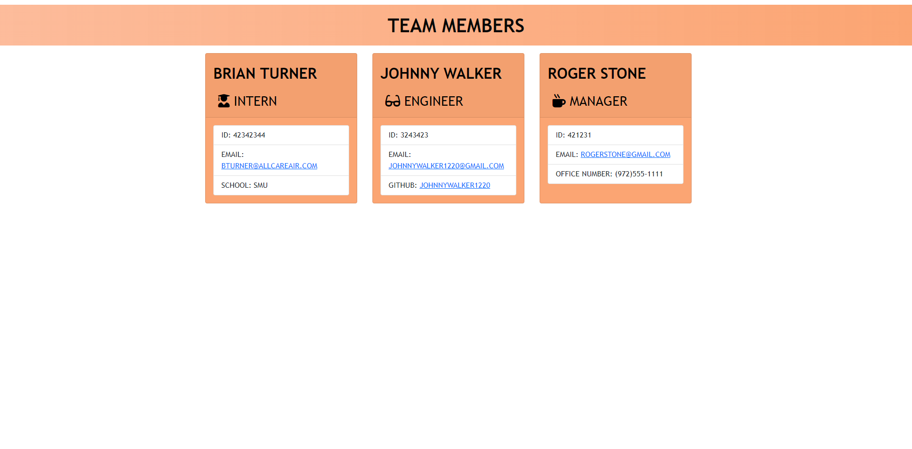

# Team Profile Generator 

## Brief Description 📖

This project required building a Node.js command-line application that takes in information about employees on a software engineering team and generates an HTML webpage that displays summaries for each person.

## Table of Contents 💡

- [Brief Description](#description)
- [About Team Profile Generator](#about)
- [Installation](#install)
- [Usage](#usage)
- [Testing](#test)
- [Screenshots](#screenshots)
- [Demo Video](#demo)
- [Github Pages Link](#pages)
- [Github Repo Link](#repo)
- [Contact Details](#contact)
- [License](#license)
- [Contributions to Repo](#contributions)
- [Additional Information](#info)

## About Team Profile Generator 

When prompted for team members and their information, then an HTML is generated that displays a nicely formatted team roster based on user input.

## Installation 🏗️

npm i

## Usage 📝

Inquirer is easiest to use when installed with npm: npm install inquirer. Then you can load the module into your code with a require call: const inquirer = require(‘inquirer’);  
 Enter management information. You will be redirected to a menu, where you can choose to add an engineer, add an intern, or end the application

## Testing 

npm test

## Screenshots 📷

## Demo Video 

<a href="https://youtu.be/0gDHoclN5f0" target="_blank">https://youtu.be/0gDHoclN5f0</a>

## Github Pages Link 

<a href="https://bkturner1220.github.io/Team_Profile_Generator" target="_blank">https://bkturner1220.github.io/Team_Profile_Generator</a>

## Github Repo Link 

<a href="https://github.com/bkturner1220/Team_Profile_Generator" target="_blank">https://github.com/bkturner1220/Team_Profile_Generator</a>

## Contact Information 

Github Username: [bkturner1220](https://github.com/bkturner1220/) 
Github: <a href="https://github.com/bkturner1220/">https://github.com/bkturner1220/</a> 
Email: <a href="mailto:bturner@texascdlprep.com">bturner@texascdlprep.com</a>

## License Information 

 
The application is covered under MIT license.

## Contributions towards Team Profile Generator 🏆

SMU Coding boot camp

## Additional Information 

If you encounter any problems, please feel free to reach out to me by sending me a [Email] to <a href="mailto:bturner@texascdlprep.com">bturner@texascdlprep.com</a>.
